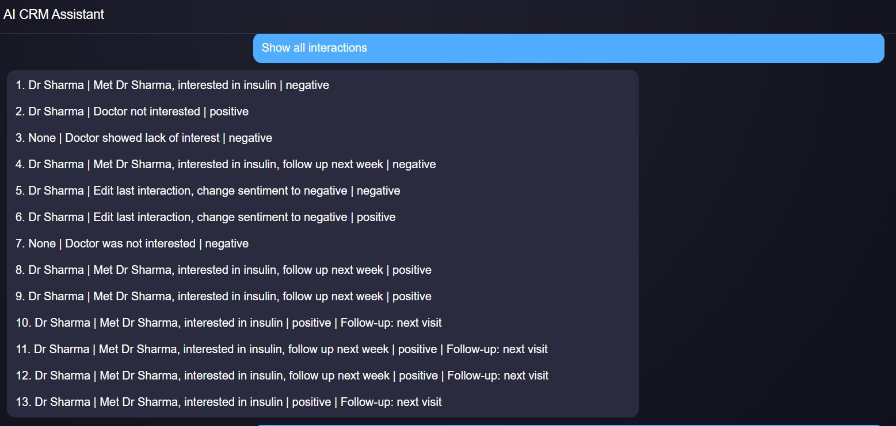
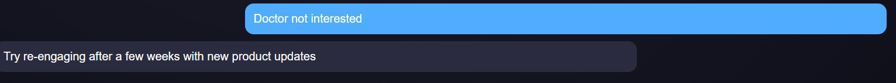

# AI-First CRM HCP Module

CRM system that uses data-driven logic to assist healthcare professionals with decision support and workflow management

## Overview
This project is an AI-powered CRM module designed for Healthcare Professional (HCP) interaction tracking. It enables users to log, edit, fetch, and analyze interactions using natural language.

## Features
- Chat-based interaction logging
- Structured data extraction using LLM
- Edit interactions dynamically
- Fetch and display interaction history
- Summarize HCP engagement
- Suggest next best actions

## Tech Stack
- Frontend: React + Redux
- Backend: FastAPI (Python)
- AI Agent: LangGraph
- LLM: Groq (LLaMA / Gemma)
- Database: SQLite (can be replaced with Postgres)

## Architecture
- React UI for interaction
- FastAPI backend for APIs
- LangGraph agent for workflow orchestration
- Tools for CRM operations

## LangGraph Flow
1. Intent Detection
2. Conditional Routing
3. Data Extraction (LLM)
4. Tool Execution

## Tools Implemented
- Log Interaction
- Edit Interaction
- Fetch Interactions
- Summarize HCP
- Suggest Next Action

---

## Setup Instructions

### Backend
```bash
cd backend
python -m venv venv
source venv/Scripts/activate   # Windows Git Bash
pip install -r requirements.txt
python -m uvicorn main:api --reload


```
### Frontend 
```bash
cd frontend
npm install
npm start

```
### Environment Variables

## Create a .env file inside backend:

GROQ_API_KEY=your_api_key_here

## How to get a Groq API Key
- Go to https://console.groq.com
- Sign in or create an account
- Navigate to API Keys
- Generate a new API key
- Copy and paste it into your .env file


### OUTPUT
## Demo Screenshots

### Chat UI



### Fetch Data

